# WPF Theme Demo

This project demonstrates a complete theming system for WPF applications, allowing customization of the application's appearance through different themes.

## Features

- Theme manager with built-in themes
- Custom theme creation and editing
- Theme import/export capabilities
- Themed message boxes
- Live theme preview

## Project Structure

- `ThemeForge` - Main application project
  - `App.xaml` - Application definition with resource styles
  - `MainWindow.xaml` - Main application window
  - `Themes/` - Contains theme-related classes
    - `Theme.cs` - Main theme class definitions
    - `ThemeData.cs` - Serializable theme data for storage
    - `ThemeManager.cs` - Manages theme application and storage
    - `MessageBoxStyleGenerator.cs` - Generates styles for message boxes
    - `CustomMessageBox.xaml` - Themed message box implementation
    - `TextInputDialog.xaml` - Themed input dialog
    - `ThemeManagerWindow.xaml` - Theme configuration window
  - `Resources/` - Contains resource images

## Getting Started

1. Open the project in Visual Studio or JetBrains Rider
2. Build and run the application
3. Use the theme selector dropdown to switch between themes
4. Click "Open Theme Manager" to customize or create new themes

## Customizing Themes

Themes consist of two main parts:
- Window Theme - Controls the appearance of application windows
- Message Box Theme - Controls the appearance of message boxes

All color properties of these themes can be edited through the Theme Manager window. 
This includes colors for combo box items and other common WPF controls.

## Adding to Your Project

To incorporate this theming system into your own project:

1. Copy the `Themes` folder to your project
2. Add the custom styles from `App.xaml` to your application resources
3. Initialize the theme manager in your application startup
4. Apply theme resources to your UI elements

## Screenshots

### Default Theme
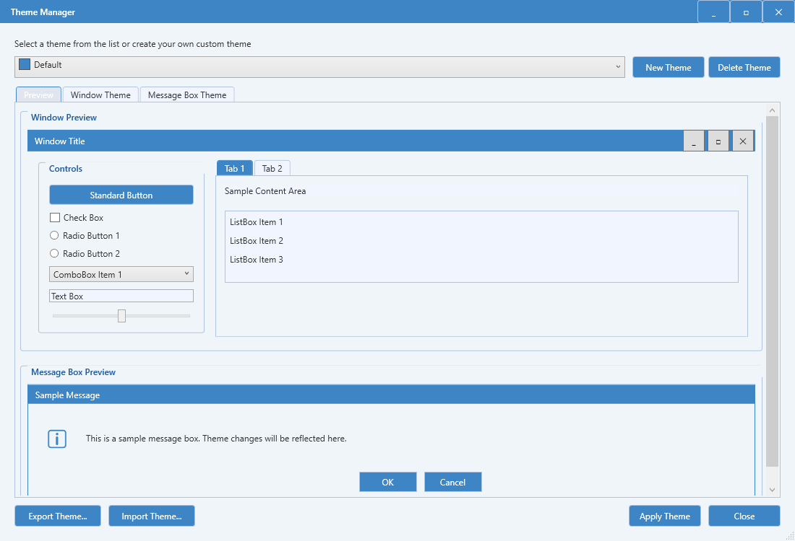

### Dark Blue Theme
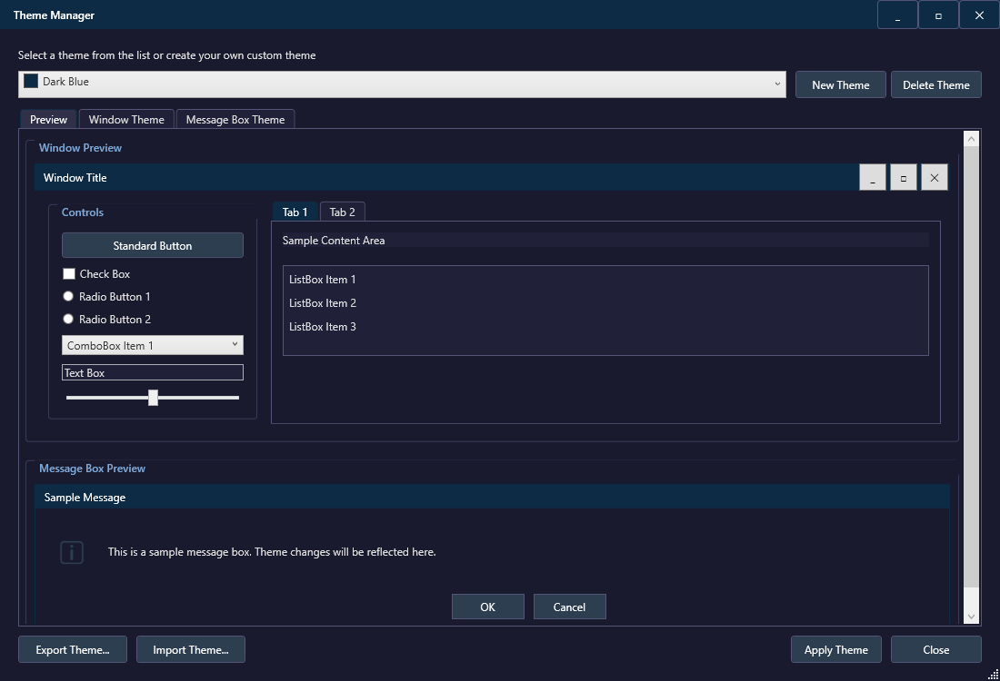

### Blue Theme
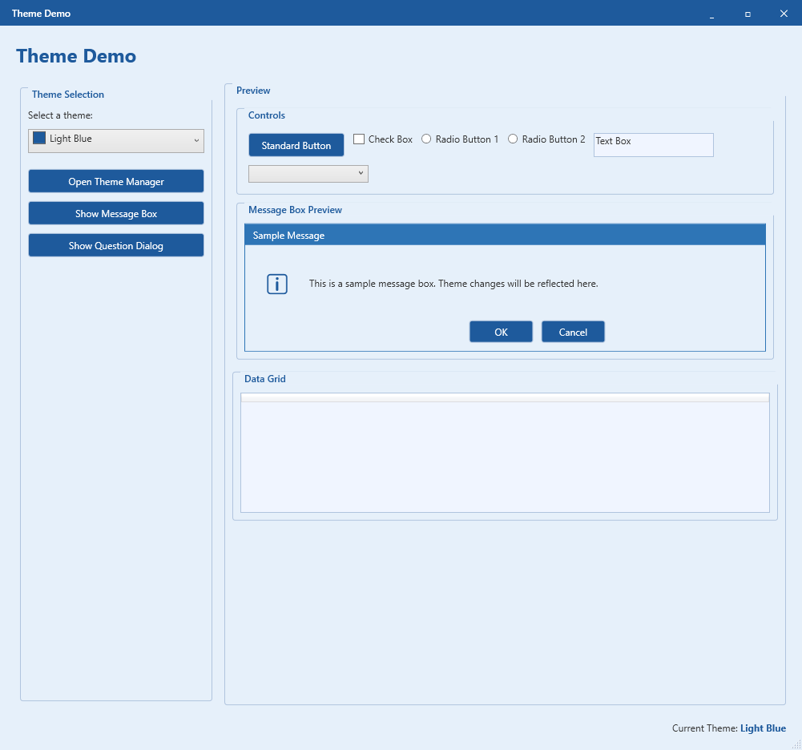

### Dark Green Theme
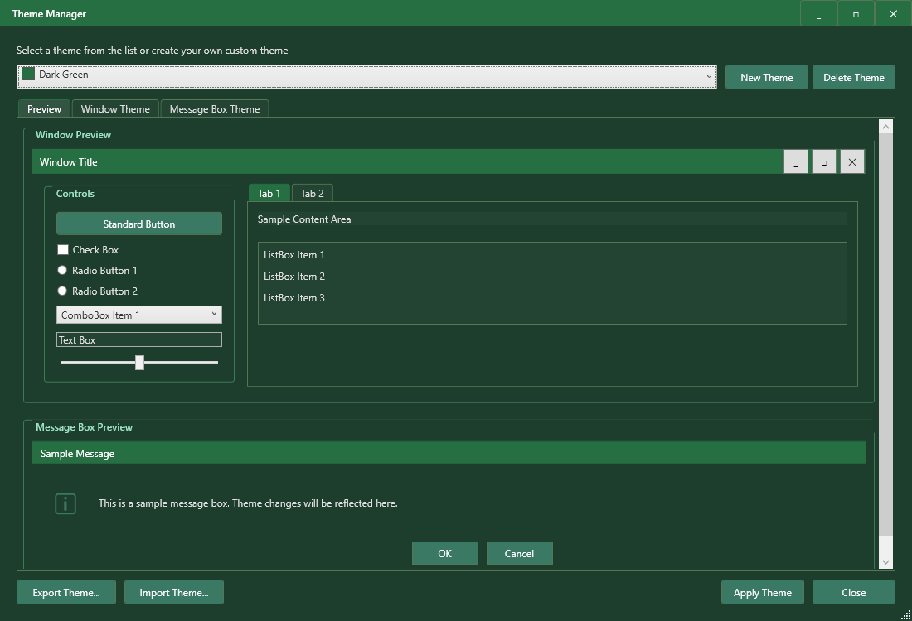

### Green Theme
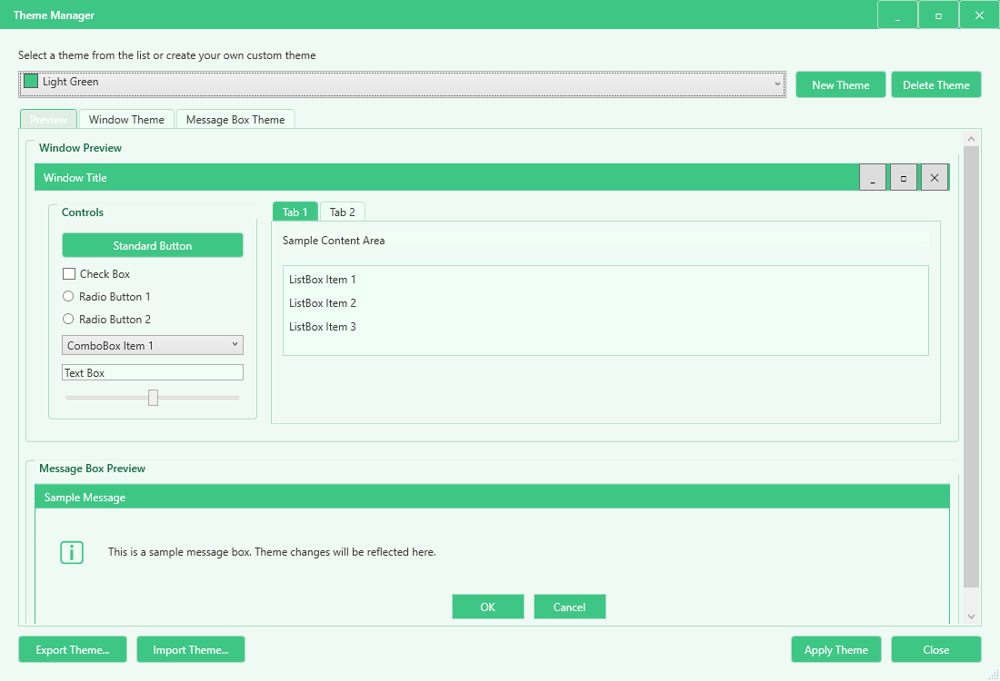

### Dark Purple Theme
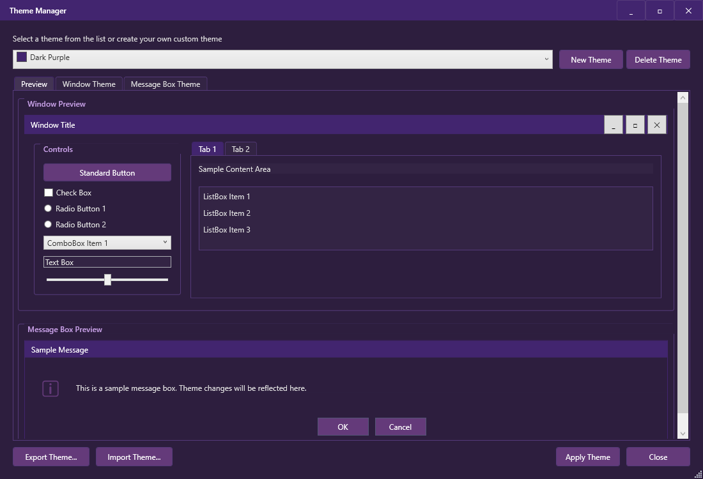

### Orange Theme
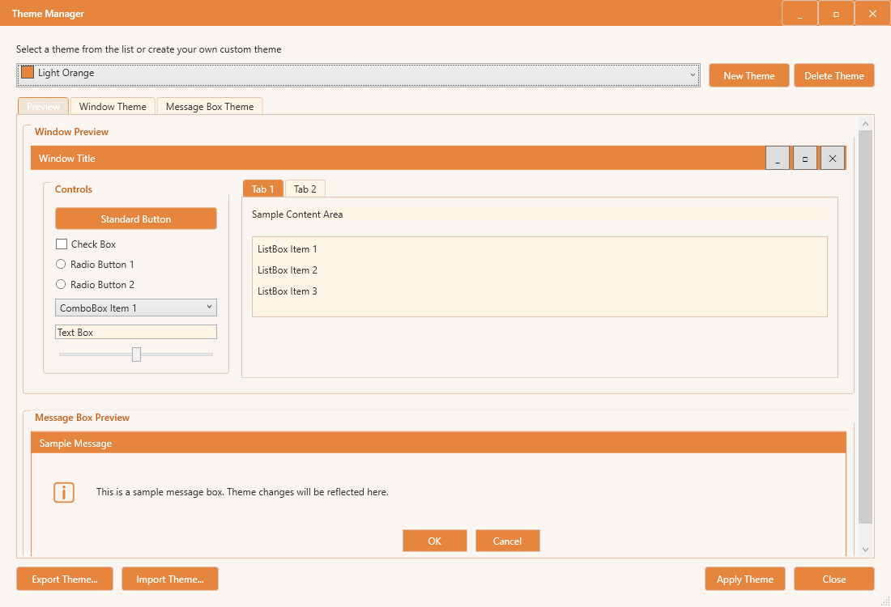

### Theme Manager with Color Customization
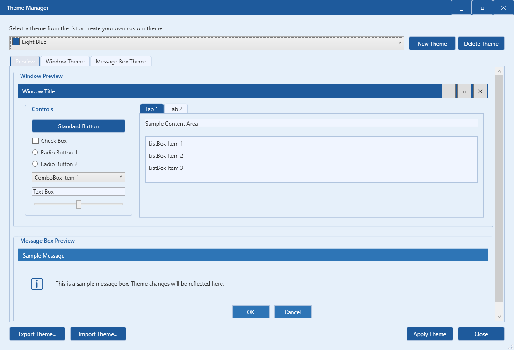

### Custom Window Colors
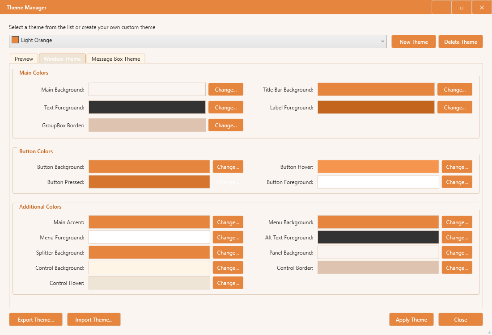

### Message Box Customizer
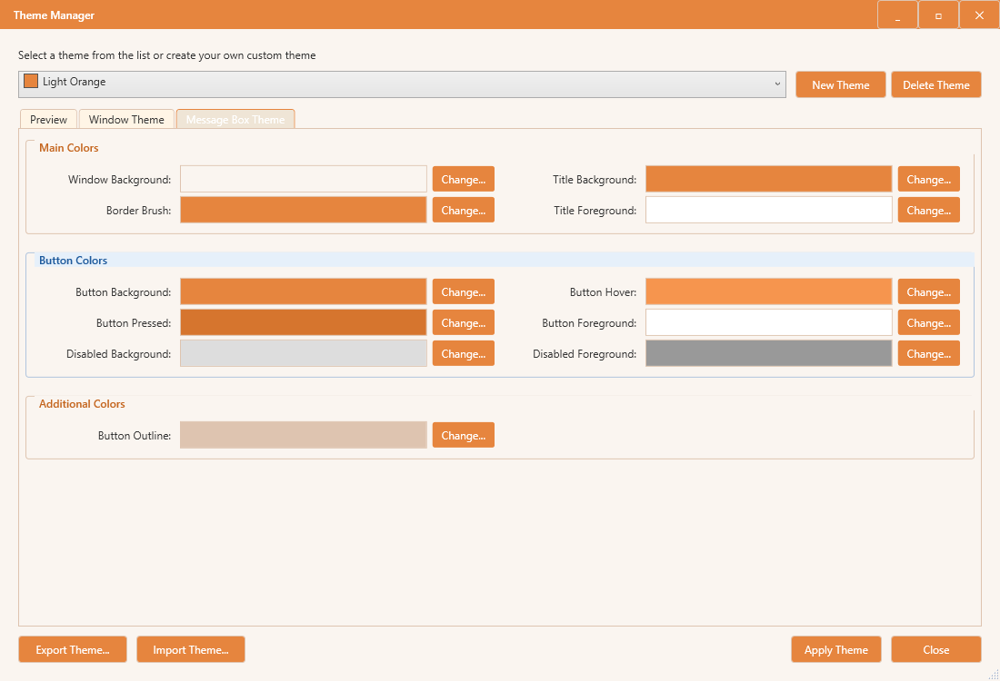

### Color Picker
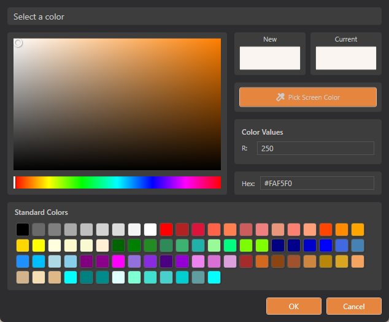

## License

This project is available for free use in personal and commercial applications.
